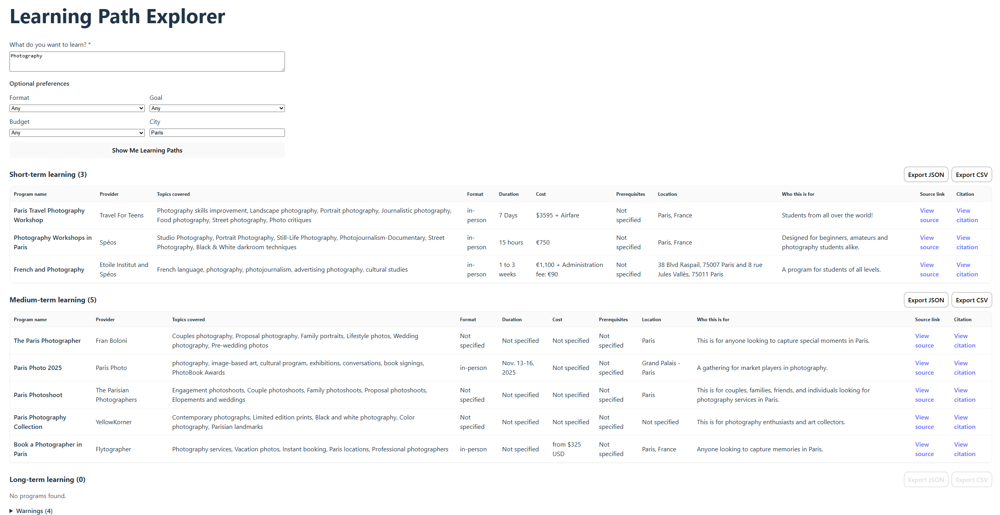

# Learning Path Explorer

A multi-agent system that discovers, extracts, and structures learning programs into short-, medium-, and long-term
learning paths based on a user query and preferences.



## Live Application

- **Frontend (UI)**: [https://djsnblkbjqabs.cloudfront.net](https://djsnblkbjqabs.cloudfront.net)
- **Backend API**: [https://d6113uwmkus7x.cloudfront.net](https://d6113uwmkus7x.cloudfront.net)

## Key Features

With this application, you can:

- Generate learning options from a free-text query, with optional preferences (format, goal, budget, location)
- Organize results into short-, medium-, and long-term learning horizons
- View key program details side-by-side to compare different options
- Access source links and citations for all web-sourced information
- Export each learning horizon independently as JSON or CSV

## Documentation

- [Product Requirements Document (PRD)](docs/PRD.md)
- [Top Level Design (TLD)](docs/TLD.md)

## Project Structure (High-Level)

- `backend/` – FastAPI backend, LangGraph agents, persistence, and integrations
- `frontend/` – Simple web UI for submitting queries and viewing results
- `docs/` – Product and technical documentation

## Deployment Architecture

The system is deployed as a distributed web application:

- A React frontend served via AWS CloudFront
- A FastAPI backend hosted on AWS
- MongoDB Atlas used as the primary data store
- External integrations with Tavily and OpenAI

### Backend Deployment

- The backend is deployed as a stateless FastAPI service
- All configuration is provided via environment variables
- No local filesystem state is required
- This allows multiple backend instances to run behind a load balancer

### Environment Configuration

Sensitive configuration is managed via environment variables, including:

- API keys (OpenAI, Tavily)
- MongoDB connection URI
- Frontend origin (CORS)

Mock- and test-specific configuration flags are intended for local development and testing only
and are not enabled in the deployed production environment.

### Frontend–Backend Integration

- The frontend communicates with the backend via HTTPS
- CORS is explicitly configured to allow the deployed frontend origin
- The backend exposes a stable `/api` interface consumed by the UI

### Database Deployment

- MongoDB Atlas is used as a managed cloud database
- The backend connects using the official MongoDB Python client
- User queries, agent runs, results, and metadata are persisted

## Architecture & Agents

The system is implemented as a multi-agent workflow using LangGraph, where a graph orchestrates execution and agents
perform domain-specific tasks such as search, extraction, and validation.

Detailed architecture, agent responsibilities, and data flow are documented in the [TLD](docs/TLD.md).

## Environment Variables

Create `.env` files based on the provided `.env.example` files in both the `backend/` and `frontend/` directories.

### Backend

| Variable       | Description                                          |
|----------------|------------------------------------------------------|
| OPENAI_API_KEY | OpenAI API key used for schema-based extraction      |
| TAVILY_API_KEY | Tavily API key for web search and content extraction |
| MONGODB_URI    | MongoDB Atlas connection string                      |
| MONGODB_DB     | MongoDB database name                                |
| CORS_ORIGINS   | Allowed frontend origin for CORS                     |

#### Mock & Testing Controls

| Variable      | Description                                                 |
|---------------|-------------------------------------------------------------|
| MOCK_EXTERNAL | Toggle external integrations (`1` = mocks, `0` = real APIs) |
| MOCK_MODE     | Mock scenario selector (`ux` or `photography`)              |

When `MOCK_EXTERNAL=1`, the system returns deterministic mock outputs for testing and development.

These variables are optional; by default, `MOCK_EXTERNAL` is set to `0` and the system uses real external API calls.

### Frontend

| Variable          | Description                 |
|-------------------|-----------------------------|
| VITE_API_BASE_URL | Base URL of the backend API |

## Data Persistence & Observability

Each request is tracked end-to-end using a generated `request_id`, which links documents across
the `requests`, `agent_runs`, and `results` collections in MongoDB.

In addition, the backend emits minimal server logs at request start, completion, and on unexpected
failures to aid debugging without duplicating persisted execution data.

## Running the Backend

From the `backend/` directory:

```bash
uvicorn app.main:app --reload
```

## Running the Frontend

From the `frontend/` directory:

```bash
npm run dev
```

The frontend will be available at [http://localhost:5173](http://localhost:5173).

## Running Tests

From the `backend/` directory:

```bash
pytest
```

Tests focus on service-level logic and graph orchestration.
All external integrations are mocked at the test level to ensure fully deterministic and isolated test runs.

## API Endpoints

- `POST /learning-paths` – Generate a personalized learning path
- `GET /health` – Health check endpoint
